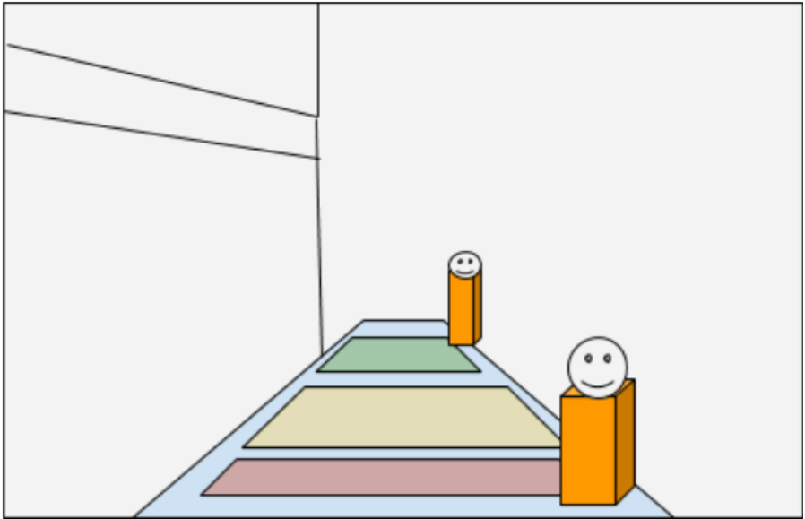
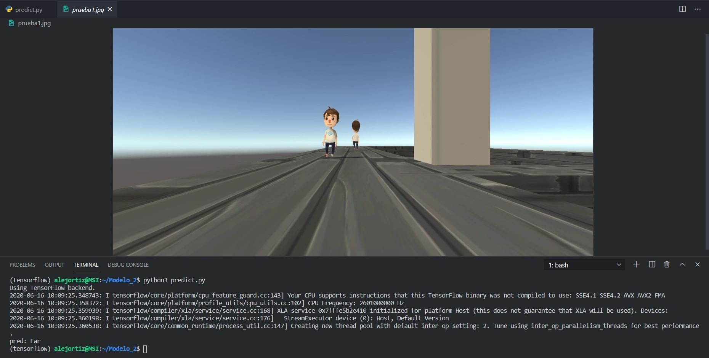
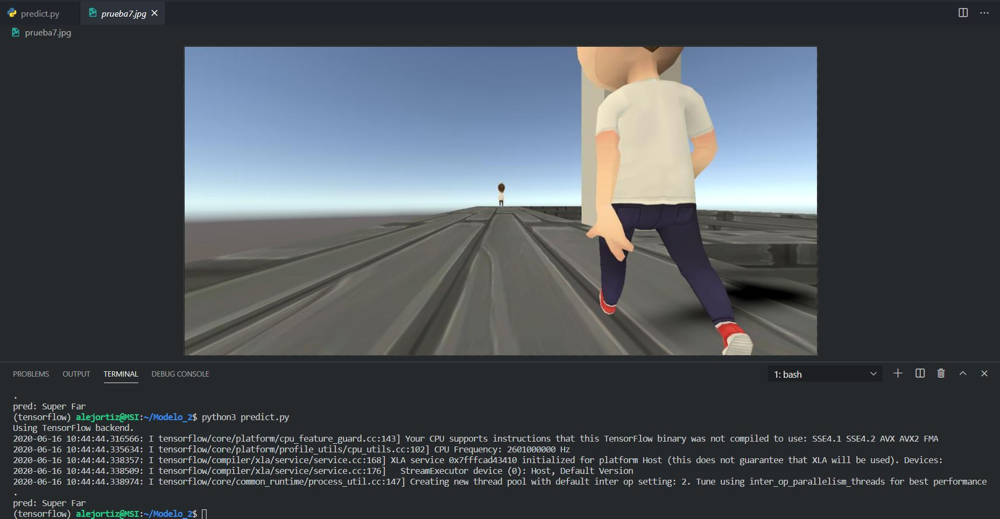
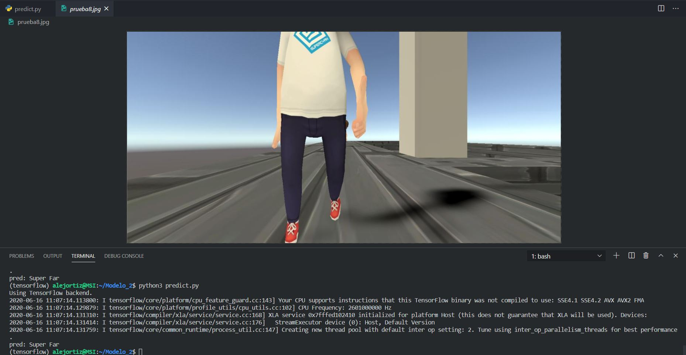
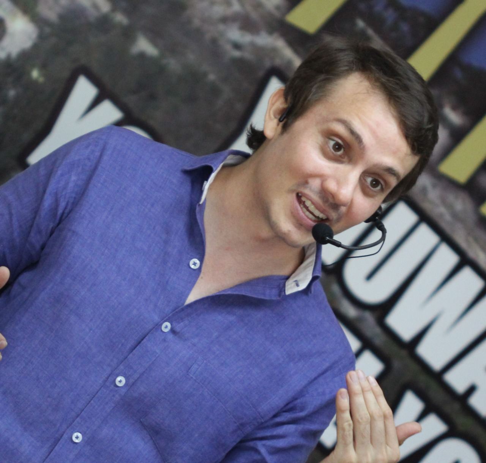
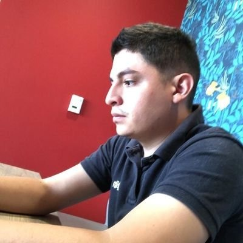

# Acqua_Kiwi_Project

## **About the Project**
Kiwi is a company of delivery services using kiwibots. The challenge of working with robots is self driving, something that the company believes can be solved completely using cameras, only vision. After trying several different approaches for the first years, kiwi have settled for a vision based detection system.

The end goal of the project is to test and use a technique, instead of calculating bounding boxes and then estimating distances to them (what the company has already implemented) the idea is to produce, out of the input image, a pseudo occupation matrix of 1x3:

The first part of the project, the mvp model can be seen as a simple classification problem. The idea is don't care for individual detections, only predict in which zone a person is located. Near, middle, far or non detection.

---
## **Data**

Any machine learning project must start by obtaining the data, in fact google some time ago launched its exclusive search engine for data collection (take a look: https://datasetsearch.research.google.com/). For this particular case, we are going to require simulated images of people walking. In order to know if a robot is capable of detecting areas of proximity such as near, medium or far. Recognizing these proximity zones would allow the robot to know if it can continue at the current speed, must reduce it, or stop.

---

## **Requirements**
||||||
:---:|:---:|:---:|:---:|:---:
|||||
|||||

---

## **How many images are required to train a CNN?**
5.000 images may be too few for a Convolutional Neural Network(CNN), in fact, research projects carried out by NVIDIA have trained around 100,000 diagnostic images of OCT (optical coherence tomography), with excellent results.

Currently our model has around 16,000 images that were generated by Unity, a simulation environment. Although we wanted to work with pre-trained models like VGG16; VGG19; ResNet50; Inception v3, they have been trained with many images, of many types, but not with the type of image that we want to classify here, so as they have realized we are in the scenario where the target data set is large and different from the set of base training data.

So as the target data set is large and different from the base data set, we created a training model, which will fit our needs, you can see this model in this [link](train.py).

---

## **Setup Environment**
> To get started on Ubuntu 20.04...
### Step 1
- Install <a href="https://www.anaconda.com/distribution/
">Anaconda </a>
- Open your terminal a type
    ~~~ 
    cd /tmp
    curl https://repo.anaconda.com/archive/Anaconda3-2020.02-Linux-x86_64.sh --output anaconda.sh
    ~~~
- Verify the integrity of the installer's data
    ~~~ 
    sha256sum anaconda.sh
    ~~~
    ***Output***
    ~~~
    2b9f088b2022edb474915d9f69a803d6449d5fdb4c303041f60ac4aefcc208bb  anaconda.sh
    ~~~
- Run Anaconda script
    ~~~
    bash anaconda.sh
    ~~~
    > You will receive the following result to review the license agreement by pressing ENTER until you reach the end.

    ***Output***
    ~~~
    Welcome to Anaconda3 2020.02

    In order to continue the installation process, please review the license
    agreement.
    Please, press ENTER to continue
    >>>  
    ~~~
    _When you reach the end of the license, type yes, if you accept the license, to complete the installation._
    >When the installation is complete, you will receive the following output:
    ~~~
    ...
    installation finished.
    Do you wish the installer to initialize Anaconda3
    by running conda init? [yes|no]
    [no] >>>  
    ~~~
- Activate the installation
    ~~~
    source ~/.bashrc
    ~~~
- Set up Anaconda environments
    >It is good practice to create new environments for each of your projects. To create a Python 3 environment called my_env, the syntax is as follows:
    ~~~
    conda create --name my_env python=3
    ~~~
    >You can activate your new environment by typing the following:
    ~~~
    conda activate my_env
    ~~~
    > When you're ready to disable your Anaconda environment, you can do so by typing the following:
    ~~~
    conda deactivate
    ~~~
### Step 2
- Prepare our anaconda environment by writing the following in the terminal:
    ~~~
    conda activate my_env
    sudo apt-get -y install python3-pip
    pip3 install tensorflow
    pip3 install pillow
    pip3 install PyYAML
    git clone https://github.com/dgquintero/acqua_kiwi_project.git
    cd acqua_kiwi_project
    mkdir data model
    cd data
    ~~~

- In the data folder you have to copy the follow images:
[drive images](https://drive.google.com/drive/folders/1_-bNPcmh9MCY8au2VYw28BK84KFOdLV4?usp=sharing) this is our simulated images we used to train the model

### Step 3
- In this moment you have to be in the data folder so lets go to move to the principal path typing **`cd ..`** after that we have to write the following:
    ~~~
    python3 train.py
    ~~~

    ***output***

    ~~~
    Found 12722 images belonging to 4 classes.
    Found 3027 images belonging to 4 classes.
    WARNING:tensorflow:From /home/alejortiz/anaconda3/envs/tensorflow/lib/python3.8/site-packages/tensorflow/python/ops/resource_variable_ops.py:1659: calling BaseResourceVariable.__init__ (from tensorflow.python.ops.resource_variable_ops) with constraint is deprecated and will be removed in a future version.
    Instructions for updating:
    If using Keras pass *_constraint arguments to layers.
    WARNING:tensorflow:From train.py:75: Model.fit_generator (from tensorflow.python.keras.engine.training_v1) is deprecated and will be removed in a future version.
    Instructions for updating:
    Please use Model.fit, which supports generators.
    2020-06-15 15:22:30.008809: I tensorflow/core/platform/cpu_feature_guard.cc:143] Your CPU supports instructions that this TensorFlow binary was not compiled to use: SSE4.1 SSE4.2 AVX AVX2 FMA
    2020-06-15 15:22:30.053568: I tensorflow/core/platform/profile_utils/cpu_utils.cc:102] CPU Frequency: 2601000000 Hz
    2020-06-15 15:22:30.056098: I tensorflow/compiler/xla/service/service.cc:168] XLA service 0x7fffe8809750 initialized for platform Host (this does not guarantee that XLA will be used). Devices:
    2020-06-15 15:22:30.056216: I tensorflow/compiler/xla/service/service.cc:176]   StreamExecutor device (0): Host, Default Version
    2020-06-15 15:22:30.057512: I tensorflow/core/common_runtime/process_util.cc:147] Creating new thread pool with default inter op setting: 2. Tune using inter_op_parallelism_threads for best performance.
    Epoch 1/20
    60/1000 [>.............................] - ETA: 12:29 - loss: 1.5688 - accuracy: 0.3232
    ~~~

    Depending on the type of computer you use, the execution time of this file may vary, for this exercise we worked with a computer with a 9th gen CORE i7 processor, an NVIDIA GeForce GTX 1650 video card with Max-Q Desing with 4Gb of Ram and 16Gb of RAM and it takes to finish 3:50 hours.

### Step 4
- After the training, you can change the image to be tested in line 32 of the file predict `predict('filename.jpg')` run now the follow code
   ~~~
   python3 predict.py
   ~~~ 
- Its everything is ok you can get a result like this in your terminal

    

---

## **Results**
For Kiwi, the sectors are very important, that's why they shared the areas that they needed to recognize, these areas are shown in the following image:

>The red zone is ***near***, the yellow is ***medium***, the green is ***far*** and where there is no color it is considered ***super far***.

During the development of the MVP and taking into account the areas of proximity given by the company, we obtained the following results

As you can see in these 2 images, the model is able to recognize if a person has their back to the robot and classifies it as super far, while if the person is facing it, it classifies it depending on the area, in this case it is in the middle area.

---

## **Bugs**
At this time the model has 89.87% of accurately predicting the image to evaluate, for this reason there may be an error of around 11% and we want to show some errors that we found during the development of the MVP

In the first photo, the image is in the far zone and the model classifies it as super far, the second photo is a photo that is clearly in the near zone, but the model classifies it in the super far zone. These errors would belong to that 11% probability of being wrong and would lead to readjusting the model.

---

## **Conclusions**
1. The model dataset must be improved, in order to have a different type of information that feeds the model and leaves it better balanced, currently it has 3 people, 2 people and 1 people on a walking street.

2. More time must be dedicated to enter to investigate the weights that the model currently has, in order to punish the error and that the model continues to learn and improve, since its accuracy is currently 89%.

3. During the development of the MVP, it was possible to achieve a simulator using Unity, train a Machine Learning model and deploy using heroku, bootstrap and js.

4. Although the Holberton foundations program did not include the technologies worked on, the Holberton program did teach us how to research and carry out a project from 0 with excellent results.

5. We consider that 5 weeks is too little time to have a model very close to reality, since we worked with simulated images, to improve this it must be put into practice with real images and doing field tests, to improve the development of the model current.

6. Teamwork is vital in this type of work, so knowing how to delegate and empower activities is important, thanks to this we were able to have an MVP according to the requirements of Holberton and Kiwi.

7. Artificial intelligence is a very powerful tool, but you have to know how to use it, for this reason the data you have is very important, since with it you train and if the data is bad, you will have bad results, but if the data is good collected you can have amazing results.

---

## **acknowledgment**
- On behalf of the team, we want to thank Holberton sincerely for giving us this opportunity to work with a company like Kiwi, for teaching us about soft skills and learning to learn.  

- To the Kiwi company, for choosing and placing their trust in us, in challenging us to carry out a project as important to the company as it is the detection of images through machine learning, to the patience and dedication of Jason Oviedo to be able to have an MVP tailored to needs.  

- To our peer Carlos Garcia, who guided us and showed the principles of Unity to be able to make a simulator of people in Unity. 

## **Authors**
| | | | | |
:---:|:---:|:---:|:---:|:---:
**Daniel Gustavo Quintero**<a></a>|**Oscar Mauricio Rodriguez**<a></a>|**Jorge Chaux Jr**|**David Alejandro Ortiz D**
